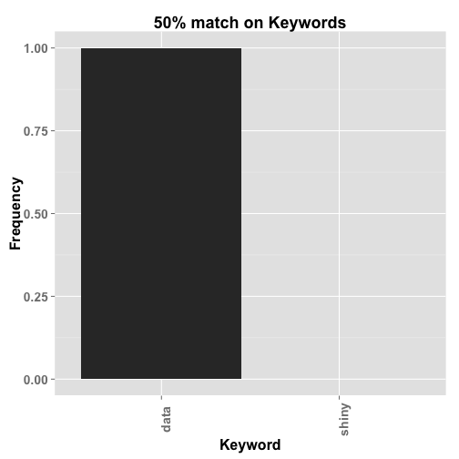

## About

The shiny app, Visualize Your Next Job, allows users to enter a potential job description and important keywords in order to visually see what desired skills, requirements, and other words show up in the job description as well as seeing how closely it matches keywords the job applicant hopes to find in the job.

The wordcloud library generates a text representation of the frequency of terms in  dataset and can be configured to display at minimum frequency level, if so desired by the author.

The barplot also matches any keywords entered by the job seeker and calculates the percentage match on the job description.

---

## The word cloud


```r
library(RColorBrewer); library(wordcloud); library(Rcpp); require(Rcpp) 
wordcloud(words=c('visualize','your','future','job','data'),freq=c(4,2,3,4,5),
          scale=c(5,.15),min.freq=1,random.order=FALSE,rot.per=.15,
          colors=brewer.pal(8,"Accent"),vfont=c("serif","plain"))
```


---

## The keyword match calculation for keywords "data" and "shiny" on job description terms.
 

---

## Find your Data Scientist dream job at ...

[https://alicia.shinyapps.io/jobwordcloud/](https://alicia.shinyapps.io/jobwordcloud/)


